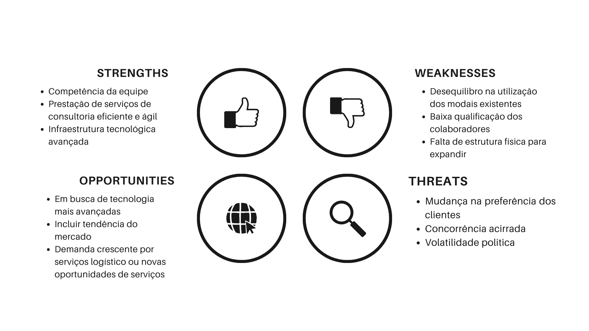
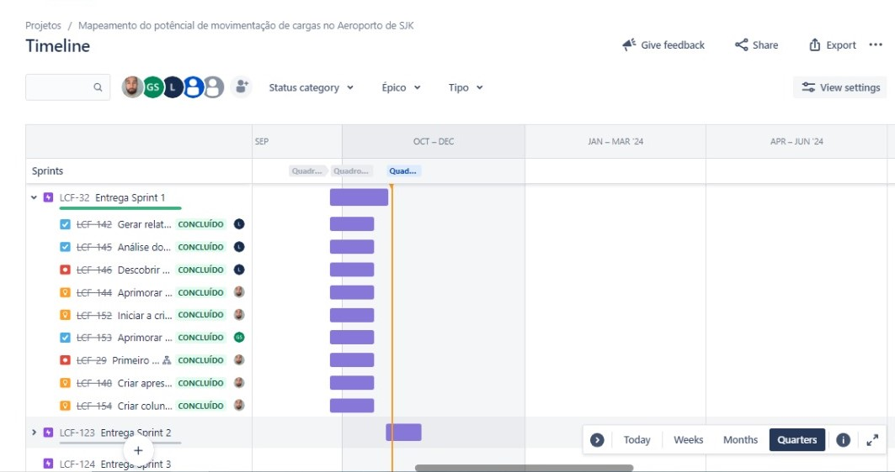

# Aprendizado por Projeto Integrado (API) - Template

Template para os projetos do curso de Logística. 

Projeto baseado na metodologia ágil SCRUM, procurando desenvolver a Proatividade, Autonomia, Colaboração e Entrega de Resultados dos estudantes envolvidos

# Índice

* [Projeto](#Projeto)
* [Equipe](#equipe)
* [Objetivo do Projeto](#objetivo-do-projeto)
* [Cronograma das Sprints](#Cronograma-das-Sprints)
* [Backlog do produto](#Backlog-do-produto)
* [Burndown](#Burndown)
* [Competências desenvolvidas](#competências-desenvolvidas)
* [Autores](#autores)

# Projeto (API) 
Projeto pedagógico alicerçado na Metodologia API para ensino-aprendizado focado no desenvolvimento de competências e fundamentada nos pilares de aprendizado com problemas reais (RPBL), validação externa e mentalidade ágil. 
Uso de estratégias para entender o problema, conceber uma solução viável ao desenvolver e implementar o MVP seguido de sua operação (CDIO). 
Os resultados dos projetos devem obedecer ao Aviso Legal disponível no site da Fatec SJC com definição das datas do kickoff e das sprints

Sprint | Previsão | Status| Histórico|
|------|--------|------|--------|
|Kick Off | 04/09/2023 | Concluido|  [Ver Relatório](RELATÓRIOLOGCLOUDKICKOFF.pdf) | 
|00 | 04/09/2023 a 25/09/2023| Concluido | [Ver Relatório](RELATÓRIOLOGCLOUDSPRINT0.pdf) | 
|01|  25/09/2023 a 23/10/2023| Concluido| [Ver Relatório](RELATÓRIOLOGCLOUDSPRINT1.pdf) | 
|02| 23/10/2023 a 13/11/2023|a fazer | [Ver Relatório](https://fatecsjc-prd.azurewebsites.net/downloads/estagio/modelo_relatorio_estagio_gpi.docx) | 
|03| 13/11/2023 a 27/11/2023|a fazer | [Ver Relatório](https://fatecsjc-prd.azurewebsites.net/downloads/estagio/modelo_relatorio_estagio_gpi.docx)  | 
|Feira de Soluções|12/12/2023 |a fazer |[Ver Relatório](https://fatecsjc-prd.azurewebsites.net/downloads/estagio/modelo_relatorio_estagio_gpi.docx) | 

# A Empresa
> Logo

      

# Equipe

      

# Autores
|    Função     | Nome                                  |                                                                                                                                                      LinkedIn & GitHub                                                                                                                                                      |
| :-----------: | :------------------------------------ | :-------------------------------------------------------------------------------------------------------------------------------------------------------------------------------------------------------------------------------------------------------------------------------------------------------------------------: |
| Product Owner |   Lucas Matheus       |                    |
| Scrum Master  | Miriã Chaves |            |
| Developer Team   | Noemy Mydory             |                  |
|  Developer Team  | Tainara Oliveira             |                  |
|  Developer Team  | Gabriel Silva               |       |
|  Developer Team | José Augusto       |                      |
|  Developer Team  | Luciana Barbosa      |                      |

> Identidade e Proposito

**MISSÃO**: A Log Cloud foi fundada com prapósito de se tornar a melhor empresa de consultoria de cargas, do mercado atual, por meio de tecnologia avançada, priorizando qualidade, responsabilidade social e desenvolvimento sustentável.

**VISÃO**: Ser referência em consultoria de logística, transporte e armazenamento.
Superar sempre as expectativas dos clientes e parceiros.
Ser reconhecida pela profissionalização de sua gestão.

**VALORES**:
* Credibilidade;
* Comprometimento;
* Integridade;
* Respeito ao meio ambiente;
* Valorização de pessoas;

> Swot da Empresa

  

      

# Objetivo do Projeto

Desenvolver um Dashboard com o propósito de avaliar as oportunidades de otimização da logística de carga no Aeroporto de SJK, utilizando informações de importação e exportação de diversas regiões

# Funcionalidades e registros (vídeos e apresnetações) das sprints

## Tecnologias Utilizadas
  ### Produto 
  > **Nome do MVP: Dashboard de Indicadores**

Objetivo do MVP é fornecer aos usuários uma visualização simples e útil dos indicadores de: principais cargas, origem, destino, custo FOB, Custo CIF, peso da carga, valor agregado.

**Recursos Principais do MVP**

- Página Principal: Exibir uma página inicial com um resumo dos indicadores 

- Gráficos Básicos: Incluir gráficos simples que representem os indicadores, valores e etc.

 ### Tecnológias Específicas/Apoio
 
 > tecnologia utilizadas na Sprint

  

      

  
# Cronograma das Sprints

## Cronograma
Ao clicar você será redirecionado ao cronograma detalhado desse projeto, lá é possivel encontar as datas das atividades, o responsável por cada atividade, o estágio em que cada atividade se encontra e a qual sprint cada atividade pertence.

#### Cronograma das Sprints[(clique aqui)](https://github.com/users/AndreLuizRibeiro/projects/4)

# Backlog do produto
  

 
**EPICS**    

**BACKLOG DA SPRINT ZERO**

**BACKLOG DA SPRINT 1**

**BACKLOG DA SPRINT 2**

# Regras de Negócio

> **Requisitos funcionais**
 
Conteúdo da apresentação  
 
Relatórios 

Experiência do usuário ao oferecer algo mais (UX)

  
> **Requisitos não funcionais**

Usar tecnologias especifícas/apoio/tecnológicas

Metodologias ágil

Power BI / Jira / Canvas
  
User stories

# Burnup

## Sprint 0. Concepção

Para criar a sprint zero, nos reunimos em sala de aula, por vídeo, ou na casa de alguém sempre que possível para definir e delegar as tarefas que cada um deveria realizar até o próximo encontro, deixando tudo organizado via 5W2H.

## Sprint 1. Desenvolvimento do Projeto
- [ ] Documento passo a passo;
- [ ] Vídeo passo a passo;
- [ ] Treinamento com os professores;
- [ ] Treinamento com os alunos;
- [ ] Monitoramento e ajustes.
      
## Sprint 2 . Implementação
- [x] Defina o propósito do template;
- [x] Identifique os elementos principais;
- [x] Esboce o layout;
- [x] Escolha cores e fontes;
- [x] Desenvolva o design;
- [ ] Teste e revise;
- [ ] Documente instruções de uso;
- [ ] Criação do vídeo;
- [ ] Finalize e aprovação.
      
## Sprint 3. Operacionalização
- [x] Defina o propósito do template;
- [x] Identifique os elementos principais;
- [x] Esboce o layout;
- [x] Escolha cores e fontes;
- [x] Desenvolva o design;
- [ ] Teste e revise;
- [ ] Documente instruções de uso;
- [ ] Criação do vídeo;
- [ ] Finalize e aprovação.

# Competências desenvolvidas

## Hard Skill (saber tecnológico)

Hard Skills desenvolvidas

   
| Tecnologia/Metodologia | Classificação |
| ---------------------- | ------------- |
| GitHub | ★ ★ ★ ★ ★ ★ ★ ★ ★ ☆ |
| Pawer Point | ★ ★ ★ ★ ★ ★ ☆ ☆ ☆ ☆ |
| Canvas | ★ ★ ★ ★ ★ ★ ★ ☆ ☆ ☆ |
| Jira Software | ★ ★ ★ ★ ★ ★ ★ ★ ★ ☆ |
| Word | ★ ★ ★ ★ ★ ★ ★ ☆ ☆ ☆ |
| Excel | ★ ★ ★ ★ ★ ★ ★ ☆ ☆ ☆ |
 

## Soft Skill (saber comportamental)

Soft Skills desenvolvidas

| Habilidades | Classificação |
| ---------------------- | ------------- |
| Colaboração | ★ ★ ★ ★ ★ ★ ★ ★ ☆ ☆ |
| Proatividade| ★ ★ ★ ★ ★ ★ ☆ ☆ ☆ ☆ |
| Pensamento Crítico | ★ ★ ★ ★ ★ ★ ★ ★ ☆ ☆ |
| Gerenciamento de Tempo | ★ ★ ★ ★ ★ ★ ★  ☆ ☆ |
| Adaptabilidade | ★ ★ ★ ★ ★ ★ ★ ★ ☆ ☆ |
| Resiliência | ★ ★ ★ ★ ★ ★ ★ ☆ ☆ ☆ |

